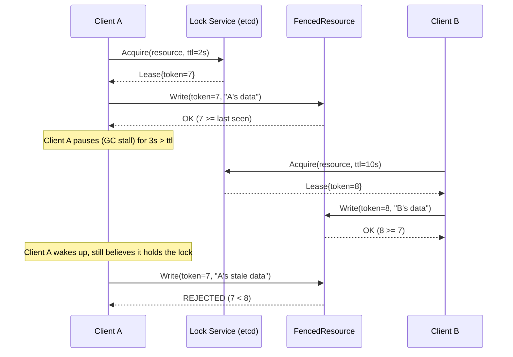

# fencelock

A Go distributed lock library built around **fencing tokens**: every lock
acquisition hands out a monotonically increasing token, and the protected
resource rejects any write that arrives with a stale token. This turns
"mutual exclusion" (unenforceable across a network) into "ordered writes
with staleness rejection" (enforceable).

**etcd** is the primary backend (linearizable; token = lock-key create
revision). **Redis** is a secondary, best-effort backend kept on purpose
as the [Redlock](https://martin.kleppmann.com/2016/02/08/how-to-do-distributed-locking.html)
counterexample — same `lock.Locker` interface, weaker foundation. See
[docs/adr/0001-backend-etcd-primary-redis-secondary.md](docs/adr/0001-backend-etcd-primary-redis-secondary.md).

Write-up: [Why your distributed lock is probably broken](https://clint-mathews.medium.com/why-your-distributed-lock-is-probably-broken-592987479e7b) (Medium).

## Prerequisites

- **Go 1.26.4+** (see `go.mod`). Older toolchains will fail to build.
- **Docker**, with a running daemon and permission to pull images, **only
  if you run tests**. The suite starts real etcd and Redis via
  [testcontainers-go](https://golang.testcontainers.org/). It does **not**
  use `docker-compose.yml`.
- Docker Compose is optional and used only for the local demo against
  etcd on `localhost:2379`.

## Install

```bash
go get github.com/Clint-Mathews/fencelock@latest
```

## Usage

Acquire a lease, then pass `lease.Token` into a `FencedResource` on every
write. Do not treat `lease.Valid()` as proof a write is safe — that check
is client-side and advisory.

```go
package main

import (
	"context"
	"log"
	"time"

	"github.com/Clint-Mathews/fencelock/etcdlock"
	"github.com/Clint-Mathews/fencelock/fencedstore"
	clientv3 "go.etcd.io/etcd/client/v3"
)

func main() {
	cli, err := clientv3.New(clientv3.Config{
		Endpoints:   []string{"localhost:2379"},
		DialTimeout: 5 * time.Second,
	})
	if err != nil {
		log.Fatal(err)
	}
	defer cli.Close()

	ctx := context.Background()
	locker := etcdlock.New(cli)
	store := fencedstore.NewMemory()

	lease, err := locker.Acquire(ctx, "orders", 10*time.Second)
	if err != nil {
		log.Fatal(err)
	}
	defer lease.Release(ctx)

	if err := store.Write(ctx, "orders", lease.Token, []byte("payload")); err != nil {
		log.Fatal(err)
	}
}
```

Redis uses the same pattern with `redislock.New(rdb)` (`github.com/redis/go-redis/v9`).
`fencedstore.Postgres` is the same `Write` contract against a table; schema
is in the comments on that type.

## Test

```bash
go test -race -timeout 5m ./...
```

First run pulls container images (etcd `v3.5.14`, Redis 7). Without Docker,
tests fail at container start, not at compile time.

`docker-compose.yml` is **not** required for `go test`. Compose is only
for a long-lived local etcd/Redis when you want to run the demo or poke
the lockers by hand:

```bash
docker compose up -d
```

## Demo

`cmd/demo` is a single process that simulates the pause → expire → fence
sequence against etcd (Client A’s connection is closed so keep-alive
stops; Client B acquires; A’s stale token is rejected).

```bash
docker compose up -d etcd
go run ./cmd/demo -endpoint localhost:2379
```

## Core idea

A distributed lock (Redis `SETNX`, etcd lease, ZooKeeper znode) can never
*guarantee* mutual exclusion: a lock holder can pause (GC, VM stall, network
partition) longer than its lease TTL, the lock expires, another client
acquires it, and now two clients believe they hold the lock at the same
time. You can't fix this with better timeouts. The fix: every time the lock
is granted, hand out a monotonically increasing fencing token, and require
the protected resource to reject any write carrying a token lower than the
highest it has already seen.

See [docs/REQUIREMENTS.md](docs/REQUIREMENTS.md) §0 for the full framing,
and [docs/adr/0002-fencing-token-source-of-truth.md](docs/adr/0002-fencing-token-source-of-truth.md)
for how the token itself is sourced and why it must never be client-computed.



## Redis is not equivalent to etcd

The Redis backend is **best-effort**. Fencing tokens on Redis still reject
a stale write after a TTL pause on a single instance (that is what Test D
shows). They do **not** make Redis linearizable or answer Kleppmann’s
Redlock critique (failover / split-brain / no monotonic sequencer from
consensus). Do not pick Redis here because you want the same guarantees as
etcd; pick it to see the weaker lock with the same API.

Details: [FR-4.4](docs/REQUIREMENTS.md),
[ADR 0001](docs/adr/0001-backend-etcd-primary-redis-secondary.md),
[`test/integration/etcd_vs_redis_test.go`](test/integration/etcd_vs_redis_test.go).

## What fencing tokens do not solve

Fencing only works if the **resource you write to checks the token**. It
does not:

- Make a third-party API safe if that API ignores tokens.
- Stop a client from talking to a store that has no `last_token` check.
- Replace consensus. The lock service still has to issue a monotonic
  server-side token ([ADR 0002](docs/adr/0002-fencing-token-source-of-truth.md)).

That limit is a non-goal, not a bug: [NFR-6](docs/REQUIREMENTS.md) and
[Explicit Non-Goals](docs/REQUIREMENTS.md).

## Documentation

| Page | What it covers |
|---|---|
| [Why your distributed lock is probably broken](https://clint-mathews.medium.com/why-your-distributed-lock-is-probably-broken-592987479e7b) | Medium write-up of the pause → expire → fence argument, with this repo as the working example. |
| [docs/REQUIREMENTS.md](docs/REQUIREMENTS.md) | Functional and non-functional requirements, non-goals, and the test-to-requirement table. |
| [docs/ROADMAP.md](docs/ROADMAP.md) | Phase status only. Requirements stay in the file above. |
| [docs/adr/](docs/adr) | Why etcd vs Redis, token source of truth, server-side TTL, and `FencedResource` as a first-class API. |
